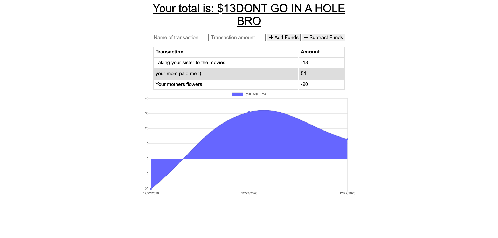

# Budget-Tracker
# Description
Budget-Tracker allows you to track your positive or negative expenses.

## Tools and Languages
> 1. JavaScript
> 2. Node.js
> 3. Express
> 4. Mongodb and Mongoose
> 6. PWA, Cache API, IndexDB
> 7. Npm packages: morgan and compression

# Snapshot

# Table of Contents 
* [Description](#Description)
* [Installation & Database SetUp](#Installation)
* [Github link](#Links)
* [Heroku](#Heroku)
* [Questions](#questions)

# Installation & Database SetUp
* To use this app npm init has to be called to create your package.json file.
* The following necessary Npm dependencies must be installed to run the application properly: the needed dependencies will be found on the package.json file.
* To properly install the database you must create at cluster on Mongodb atlas.
* Run "npm run dev" for the port to start listening with mongoose.

# Github link
[Budget-Tracker Repo](https://github.com/Mcowley1/budget-tracker)

# Heroku
[Budget-Tracker Heroku link](https://git.heroku.com/enigmatic-brook-39247.git)

# Questions?
## Contact me:
  * [My GitHub Profile](https://github.com/Mcowley1)
  * Email at: matthewcowley01@gmail.com